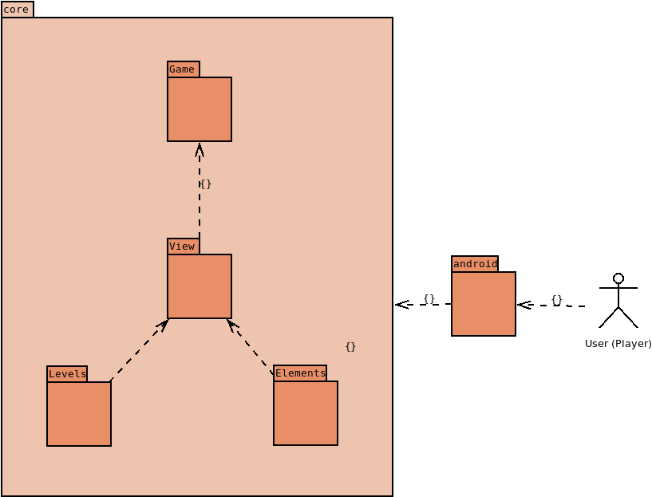

# LPOO1718 2nd PROJECT CHECKPOINT 
### Team Members (T2G10)  
**Patrícia Janeiro Leite da Fonseca**  
201605946  
up201605946@fe.up.pt  
**Pedro Manuel Monteiro França Santos**  
201200764  
ei12056@fe.up.pt  

## Maze Tilt Android Game Using libGDX

The player is suposed to guide a ball through a maze of walls and obstacles using the accelerometer of a mobile device (tilting said device), the final objective is for the ball to enter a specific hole.

### Architecture Design
#### First approach (scratch) of the package and class diagrams (UML)

#### behavioural aspects

#### Expected Design Patterns to use on our application (the ones we are considering)
**State** - To change the levels and maybe updating the sprites.   
**Observer** - To allow the user to control and move the ball (we will probably use box2d library from libGDX).   
**strategy** - So that we can have "different" ball animations and simulate "zones" with diferent speeds.  
**Visitor** - This one is very important because we need to test if the ball collides with the walls so that it's not able to room around zones where its not supposed to, and also to test "collisions" with the holes(objective) and obstacles.  
**Flyweight** - To use in the user interface.   

### GUI Design
#### Identification/Listing of the main functionalities

#### GUI mock-ups

### Test Design
#### Listing of the expected final test cases
-Test if the ball collides with the walls.  
-Test if the player loses if the ball enters a hole other than the objective(final) hole  
-Teste if the player wins if the ball enters the objective hole.  
(We're not yet sure how to go about implementing the tests given that the movement of the ball if controlled by the device accelerometer)  
