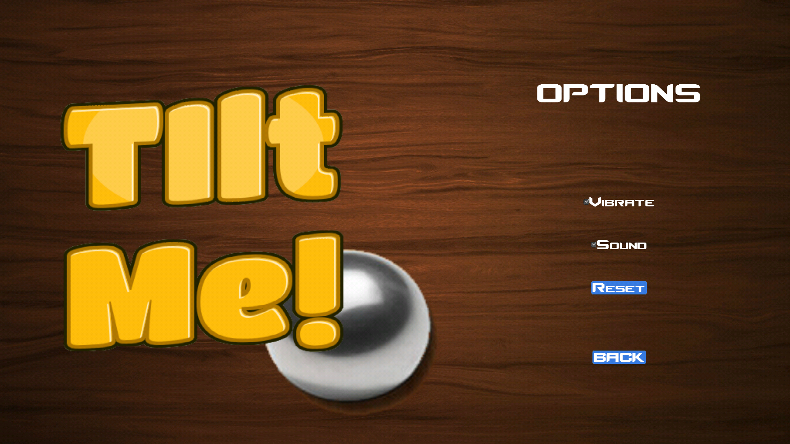

# Final Project for OOP Lab class @FEUP 
## LPOO1718_T2G10_P2

### Team Members  
**Patrícia Janeiro Leite da Fonseca**  
201605946  
up201605946@fe.up.pt  
**Pedro Manuel Monteiro França Santos**  
201200764  
ei12056@fe.up.pt  

## a. Full project source-code, including unit tests.
The project source code is all available in the root of this git rep.
Due to the nature of our game we weren't able to include unit test cases because the only input we use is from the mobile device accelerometer

## b. Platform-specific executable file(s) of the game/app.
Our app runs only on android devices, a single file .apk file can be found in the folder named APK located at the root of this git rep.

## c. Javadoc documentation files.
Javadoc documentation for this project can be found in the folder named JavaDoc located at the root of this git rep.

## d.
### d1. - Setup/Installation procedure for both project and game/app (how to install the development environment and how to install/run the game/app).
#### project
You can download the full source code available in this rep and open it with any IDE able to import gradle project. After that you can run it in an emulator or an android device connected to your computer through a usb cable (in this case you will need to enable developer mode in your android device)
#### game/app
You can copy the single file /APK/TiltMe.apk to a folder in your android device and intall the game on said device, after that you can use it as any other normal app.

### d2.

### d3.  - User manual (with screenshots explaining how to play/use the game/app).
The main objective of the game is to guide a ball through a maze of obstacle (wrong holes and walls) using the phone accelerometer (tilting the device) to reach the final/winning hole!

Intro image:

Main menu: 
In the main menu the user can either chose to play the game, go to the options menu or exit the app.

Options menu: 
In the options menu the user can enable/disable the app music and/or vibration (all menus and gameplay have music, and the device vibrates when the ball hits a wall) both are active by default. The user can also 'reset'/delete is progress (unlocked levels and score). 'back' will take you the user back to the main menu.

Levels menu: 
From Main menu if the user hits 'Play' he will go to this screen. The buttons marked with '?' are levels the user has not yet unlocked. To unlock a level the user must pass a previous level. If the user hits a button with a level number he will go to that level and be able to play it. 'Main Menu' button will take you the user back to the main menu.

Play Screen: 
This is the exemple of a level, the user must guide a ball through a maze of obstacle (wrong holes and walls) using the phone accelerometer (tilting the device) to reach the final/winning hole!

Win Screen: 
If the user reach the final/winning(blue) hole he will see this screen and if he touches it anywhere he will go to the Levels menu. The number of stars are anmated(rotating) and represent the score the from 1 to 3 the user got in that level. The score is based only on the amount of time the user took to finish the level.

Lose Screen: 
If the user falls in a wrong(black) hole he will see this screen and if he touches it anywhere he will go to the Levels menu

